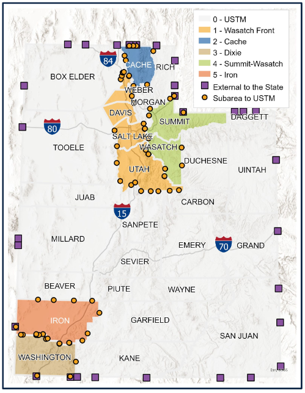

  

    
  

  

    <h2>Model Info Sheets</h2>
    
<a href="../images/0 - USTM.pdf" target="_blank">0 - Utah Statewide Model</a>

    
<a href="../images/1 - WF.pdf" target="_blank">1 - Wasatch Front Model</a>

    
<a href="../images/2 - Cache.pdf" target="_blank">2 - Cache Model</a>

    
<a href="../images/Dixie.pdf" target="_blank">3 - Dixie Model</a>

    
<a href="../images/4 - SuWs.pdf" target="_blank">4 - Summit-Wasatch Model</a>

    
<a href="../images/5 - Iron.pdf" target="_blank">5 - Iron Model</a>

        

    <h2>Model Documentation</h2>
    
<a href="https://docs.google.com/document/d/1d8OeD8pqkbAbmRJUamJOKT6X-C_1q3wkwFm86VH3-Ys/edit?usp=sharing" target="_blank">USTM v3.0 - Validation Report</a>

    
<a href="https://wfrc.org/wftdm-docs/" target="_blank">Wasatch Front Model</a>

    
<a href="https://docs.google.com/document/d/1YACqLThIzTFPVFirpDEbmpCWsYzpBMSenry-8j0a_ZU/edit?usp=sharing" target="_blank">Summit-Wasatch v2.2 - Validation Report</a>

    
<a href="https://docs.google.com/document/d/1RdpfMC31aGn1zKmtGFW0qNq8EFJNAlndGYY7Rj0EavA/edit?usp=sharing" target="_blank">Iron v1.0 - Validation Report</a>

  

