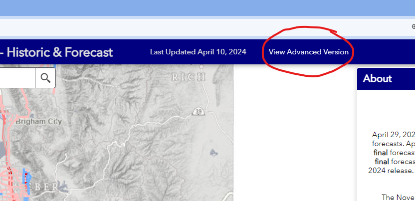
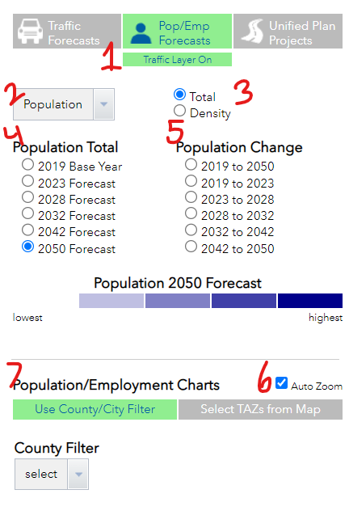
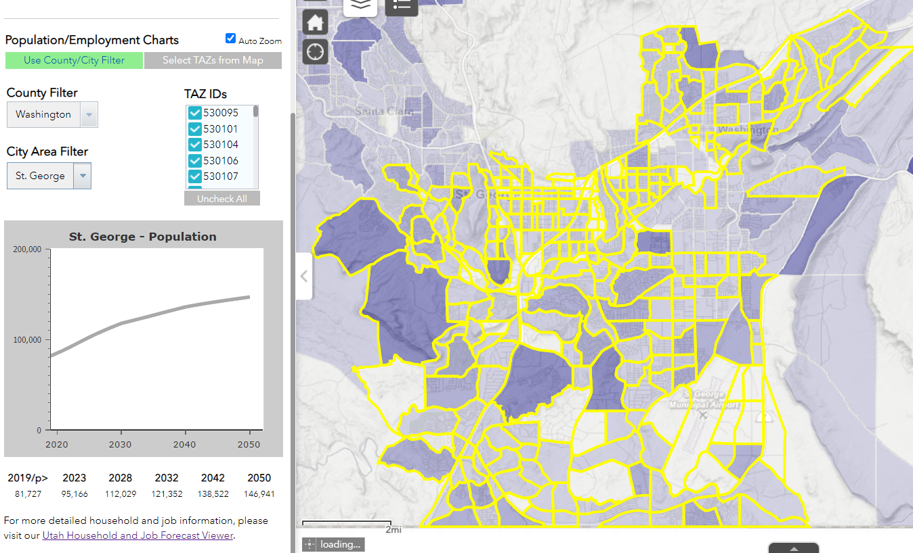
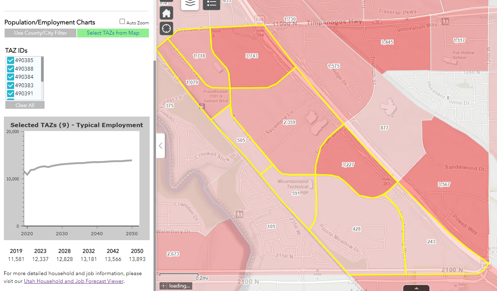
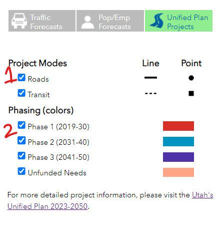

The *Advanced Version* of the roadway volume forecasts is now live and can be accessed at [https://unifiedplan.org/traffic-volume-map/](https://unifiedplan.org/traffic-volume-map/). This update integrates comprehensive socio-economic data and project details from the 2023 transportation plans into the traffic volume map.

The *Advanced Version* introduces two new modules within the app: socioeconomic forecasts and Unified Plan Projects. Both modules provide statewide data. The household and jobs data comes from the [Utah Household and Job Forecast Viewer](https://unifiedplan.org/utah-household-job-forecast-map/). The project data comes from [Utah's Unified Transportation Plan 2023-2050](https://experience.arcgis.com/experience/e2b10d6141cc4d91900f783dbdeefed5/).

In this blog post, we'll revisit the features and data offered by these two modules, providing you with a description of their functionality within the traffic volume map.

To access the *Advanced Version*, click on 'View Advanced Version' in the top header, as shown here:

After you click, a header above the sidebar will appear that will enable switching to the two modules:

# Pop/Emp Forecasts Module

The population and employment forecasts module display a subset of the official forecasts within the app.

<table>
    <tr>
        <td style="vertical-align: top; width:35%;">
            
        </td>
        <td style="vertical-align: top;">
            
<strong>1:</strong> Click this button to toggle on and off the traffic volume layer.

            
<strong>2:</strong> Click on this drop down to access the attribute you want to display: population, households, typical (total) employment, retail employment, industrial employment, and office employment.

            
<strong>3:</strong> Here you can choose between showing the total number of population/employment or the density of population/employment per developable acre.

            
<strong>4:</strong> This column of options allows you to choose what single-year forecast you want displayed.

            
<strong>5:</strong> This column of options allows you to choose a time range to show the difference between two forecasts for different years. In the map, blue intensity is level of decrease and red intensity is level of increase.

            
<strong>6:</strong> Turn off Auto Zoom here, if you want the map to stop moving as you click features or change selections.

            
<strong>7:</strong> The population and employment charts are described in the next section.

        </td>
    </tr>
</table>

## Population/Employment Charts - Use County/City Filter

<table>
    <tr>
        <td>
            
When <i>Use County/City Filter</i> is selected, you can select a <i>County</i> and a <i>City Area</i> to filter the population and employment data. A chart is created that shows trends for the city area, and associated TAZs are also highlighted in yellow in the map.

        </td>
    </tr>
    <tr>
        <td style="vertical-align: top;">
            
        </td>
    </tr>
</table>

## Population/Employment Charts - Select TAZs from Map
<table>
    <tr>
        <td>
            
When <i>Select TAZs from Map</i> is selected, you can click on TAZs in the map to filter by your selection. Clicking on a TAZ will add it to the selection, and clicking on it when it's already selected will remove it from the selection. A chart is created that shows trends for the selection. Associated TAZs are also highlighted in yellow in the map.

        </td>
    </tr>
    <tr>
        <td style="vertical-align: top;">
            
        </td>
    </tr>
</table>

# Unified Plan Projects Module

The Unified Plan projects module display a subset of the official plan within the app. Each project in the map is clickable for more detailed information.

<table>
    <tr>
        <td style="vertical-align: top; width:35%;">
            
        </td>
        <td style="vertical-align: top;">
            
<strong>1:</strong> Check the modes of the projects you want to display on the map.

            
<strong>2:</strong> Check the phases you would like displayed on the map.

        </td>
    </tr>
</table>