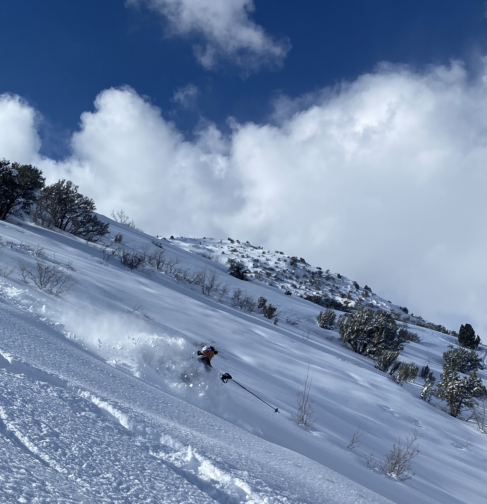

    

        
BERT GRANBERG

        
    

    

        <strong>Education:</strong> Audrey Webb Child Study Center (Stephens College), Carleton College, University of Utah; Science Technology and Public Policy; Transportation GIS   
		
		<strong>Current Employment:</strong> Analytics Director at WFRC   
		
        <strong>Greatest Interests about Travel Demand Modeling and Forecasting:</strong> The ability to better understand and convey the landscape of regional travel; use of the model to test scenarios   

        <strong>Favorite Modeling Project(s):</strong> Anything and everything that we are able to share on the web via tools, slide decks, datasets, etc. In 2024, if it's not internet accessible, did it really happen?   

        <strong>Valuable Resources, Tools or Software:</strong> Anything and everything that we are able to share on the web via tools, slide decks, datasets, etc. In 2024, if it's not internet accessible, did it really happen?     

        <strong>Hobbies and Interests:</strong> Human-powered outdoor adventure mixed with a healthy dose of culture -- arts, entertainment, travel, food, etc.    

    

