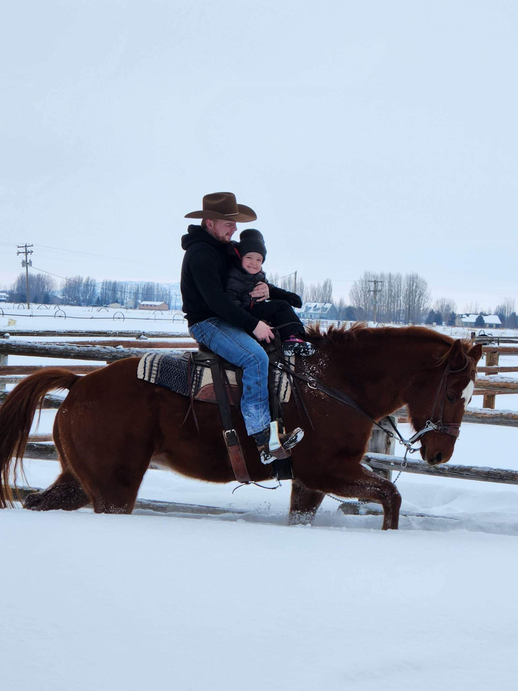

    

        
ISAAC GARDNER

        
    

    

        <strong>Education:</strong> BS Public Policy and Administration - BYU-I and Arkansas State   
		
		<strong>Current Employment:</strong> Cache MPO - Planning Manager   
		
        <strong>Greatest Interests about Travel Demand Modeling and Forecasting:</strong> The ability to have some idea of what will happen in the future is remarkable to me, and it helps to give me an idea of the things that should happen in the community that I live in.    

        <strong>Valuable Resources, Tools or Software:</strong> GitHub and Tim Hereth   

        <strong>Hobbies and Interests:</strong>  I own horses, and love going riding. I also love going on hikes with my two dogs.     

    

