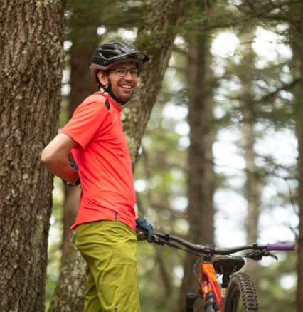

    

        
Austin Feula

        
    

    

        <strong>Education:</strong> UMass Lowell – Masters of Transportation Engineering   
		
		<strong>Current Employment:</strong> METHODS Consulting, Transportation Engineer/Planner   
		
        <strong>Greatest Interests about Travel Demand Modeling and Forecasting:</strong> I really enjoy the socioeconomic forecasting side of things and thinking big-picture about the type of growth cities will see. I especially enjoy taking vague and often messy information about future growth and translating it into realistic forecasts.   

        <strong>Favorite Modeling Project(s):</strong> My work for Daybreak, where I built an extremely detailed model of that area. It was a valuable tool for demonstrating that a well-connected street network can handle significant traffic volumes on mostly 2-lane roadways. Without that model to show how effectively traffic distributes through their grid, I think it's very likely some roadways would have been unnecessarily widened.   

        <strong>Valuable Resources, Tools or Software:</strong> Have you all heard of Excel before?   

        <strong>Hobbies and Interests:</strong> Right now, my primary hobby is pushing my 9-month-old daughter in a stroller for her 100th lap around the neighborhood while she naps. Beyond that, I serve as president of my local trail organization (Upper Valley Mountain Bike Association), which maintains, builds, and advocates for trails in the region.    

    

