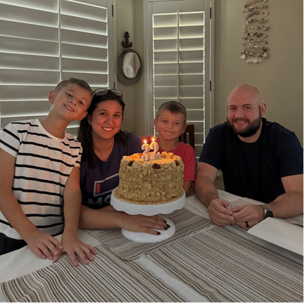

    

        
Natalia Brown

        
    

    

        <strong>Education:</strong> BYU, Universidad Catolica de Chile – Civil Engineering   
		
		<strong>Current Employment:</strong> UDOT, Travel Demand Modeling Program Manager   
		
        <strong>Greatest Interests about Travel Demand Modeling and Forecasting:</strong> The idea that we can test alternative futures!! What could happen if...?   

        <strong>Favorite Modeling Project(s):</strong> This last round of model preparation for the LRP. I was more involved in the various pieces and found it fascinating all the work that going into having a calibrated model.   

        <strong>Valuable Resources, Tools or Software:</strong> Having a good mentor is probably #1! Chad Worthen's mentorship was critical for me in the space. I'm a big believer in documentation too. The utahmug.org website has the latest validation reports and documentation.   

        <strong>Hobbies and Interests:</strong> Making labels and organizing. I love using my Cricut for keeping my house nice and organized.    

    

